# crAPI Application Security Assessment

## Important Info

> This document is part of a simulated white-box security assessment of OWASP crAPI for training and community reference. The client, contacts, scope details and engagement artifacts are fictitious.

## 0a. Document Control and Revision History

| Field | Details |
|---|---|
| Document Title | crAPI Application Security Assessment - Application Overview |
| Document Type | Phase 1 Reconnaissance / Functional Baseline |
| Engagement | crAPI Application Security Assessment |
| Client Representative | Mr. Mario |
| Assessment Lead | Mr. Wario |
| Environment | UAT |
| Related GitHub Issue | Issue #3 - Baseline normal application functionality |
| Document Owner | Mr. Wario |
| Version | 1.0 |
| Status | Final |
| Date Created | 11 September 2026 |
| Date Finalized | 12 September 2026 |
| Classification | Engagement Confidential / Training Simulation |
| Repository Location | `01-recon/application-overview.md` |
| Evidence Location | `01-recon/screenshots/` |
| Next Review | As required during reconnaissance or if application functionality materially changes |

### Revision History

| Version | Date | Author | Description |
|---|---|---|---|
| 0.1 | 11 September 2026 | Mr. Wario | Initial application baseline structure created |
| 0.2 | 11 September 2026 | Mr. Wario | Added user-management, core-feature and supporting-feature observations |
| 0.3 | 11 September 2026 | Mr. Wario | Added workflow summary, application objects and follow-up reconnaissance observations |
| 1.0 | 12 September 2026 | Mr. Wario | Finalized Phase 1 application functional baseline for Issue #3 |

## Table of Contents

- [0a. Document Control and Revision History](#0a-document-control-and-revision-history)
- [0b. Purpose](#0b-purpose)
- [1. Application Context](#1-application-context)
- [2. User and Account Management](#2-user-and-account-management)
  - [2.1 Login](#21-login)
  - [2.2 Registration](#22-registration)
  - [2.3 Password Recovery / Password Change](#23-password-recovery--password-change)
  - [2.4 User Profile Management](#24-user-profile-management)
  - [2.5 Logout](#25-logout)
- [3. Core Application Features](#3-core-application-features)
  - [3.1 Dashboard / Home](#31-dashboard--home)
  - [3.2 Vehicle Management](#32-vehicle-management)
  - [3.3 Shop](#33-shop)
  - [3.4 Coupon](#34-coupon)
  - [3.5 Orders and Returns](#35-orders-and-returns)
  - [3.6 Community](#36-community)
- [4. Supporting and Extra Features](#4-supporting-and-extra-features)
  - [4.1 ChatBot](#41-chatbot)
  - [4.2 Email / MailHog](#42-email--mailhog)
  - [4.3 Other External / Supporting Interactions](#43-other-external--supporting-interactions)
- [5. Normal Workflow Summary](#5-normal-workflow-summary)
- [6. Application Objects Observed](#6-application-objects-observed)
- [7. Observations and Follow-up Reconnaissance](#7-observations-and-follow-up-reconnaissance)
- [8. Functional Baseline Summary](#8-functional-baseline-summary)

## 0b. Purpose

Establish a simple, screenshot-supported baseline of how crAPI works normally before security testing. Each screenshot should have one primary home in this document; reference it elsewhere rather than duplicating it.

## 1. Application Context

| Item | Value |
|---|---|
| Application | crAPI |
| Environment | UAT |
| Primary URL | `http://127.0.0.1:8888` |
| Initial unauthenticated page | `/login` |
| Test account | Standard authenticated test user |

## 2. User and Account Management

Everything related to the user account belongs here: login, registration, recovery, profile management, password changes and logout.

### 2.1 Login

Observed: the initial unauthenticated page is the Login page.

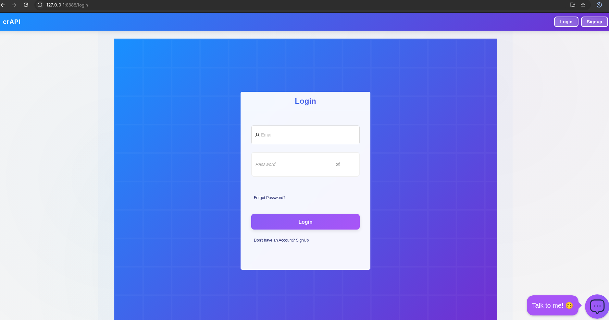

*Figure 1.0 - crAPI login page*

### 2.2 Registration

Observed fields: Full Name, Email, Phone No., Password and Re-enter Password. The phone field performs format validation. Registration succeeded after a valid phone number was supplied.

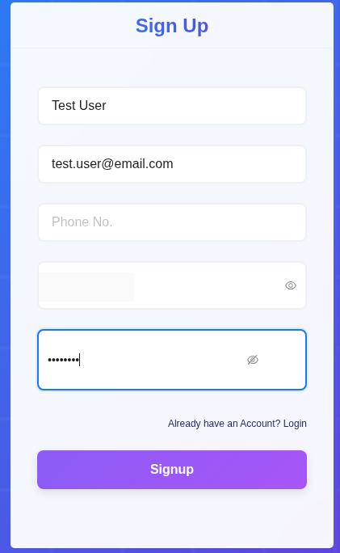

*Figure 2.0 - Registration form*

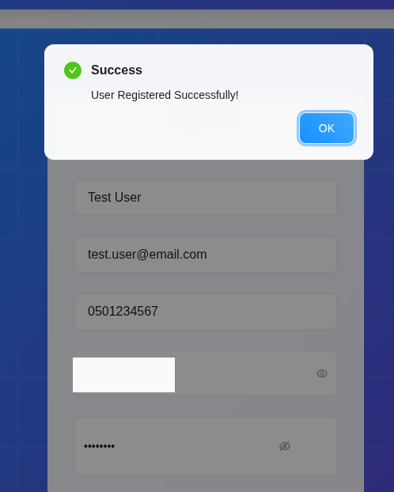

*Figure 3.0 - Successful user registration*

### 2.3 Password Recovery / Password Change

Observed Forgot Password flow: Step 1 Email Verification -> Step 2 Reset Password. Step 1 requests Email ID and provides Send OTP.

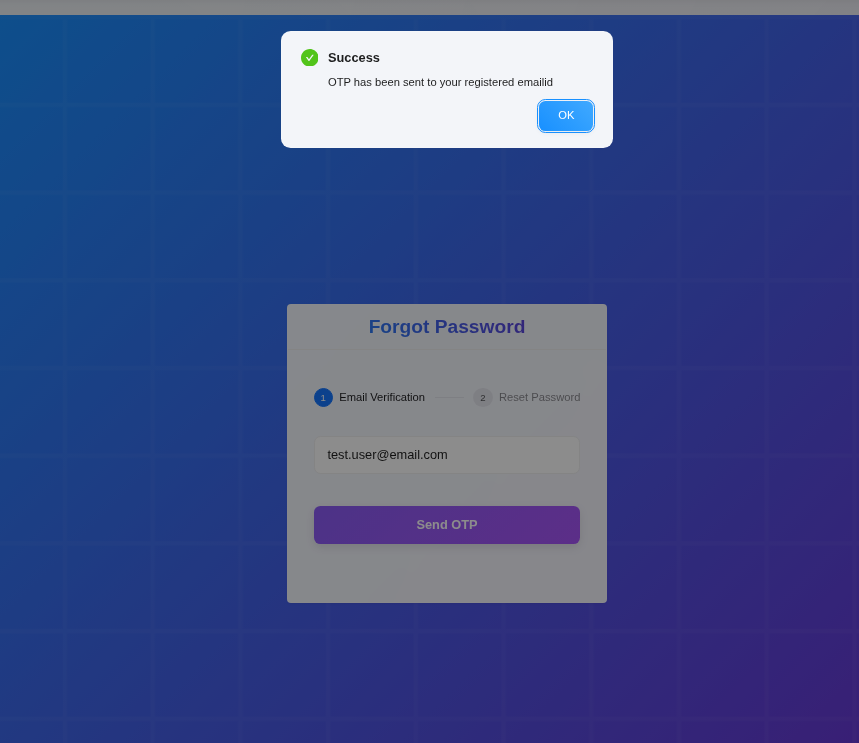

*Figure 4.0 - Password recovery OTP sent confirmation*

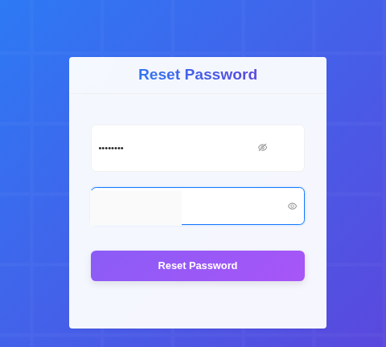

*Figure 5.0 - Reset Password screen*

### 2.4 User Profile Management

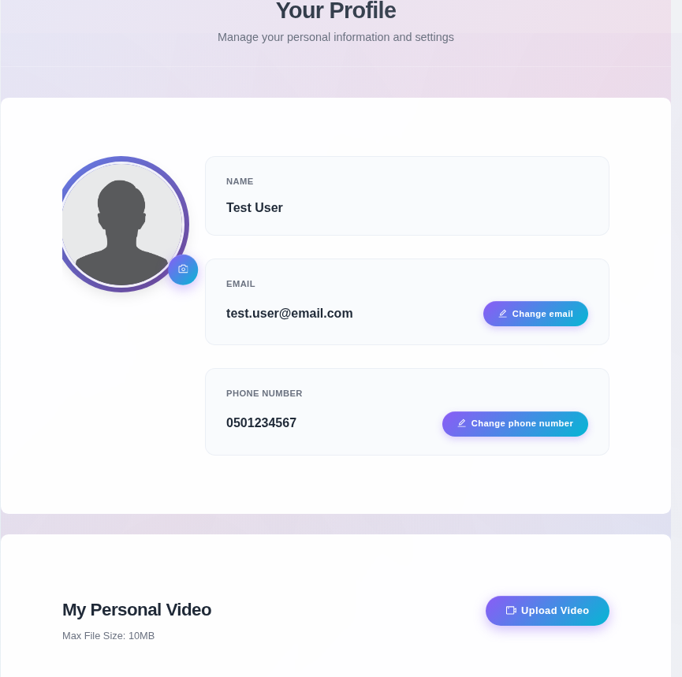

*Figure 6.0 - User profile management page*

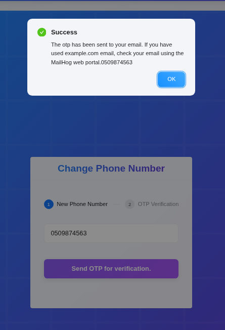

*Figure 7.0 - Change phone number OTP workflow*

### 2.5 Logout

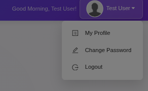

*Figure 8.0 - User menu with Logout option*

## 3. Core Application Features

This section records the main business functionality available to the normal authenticated user.

### 3.1 Dashboard / Home

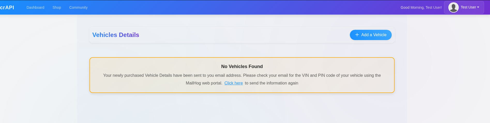

*Figure 9.0 - Authenticated dashboard and vehicle details area*

### 3.2 Vehicle Management

Observed: a user can add a vehicle using a VIN and PIN.

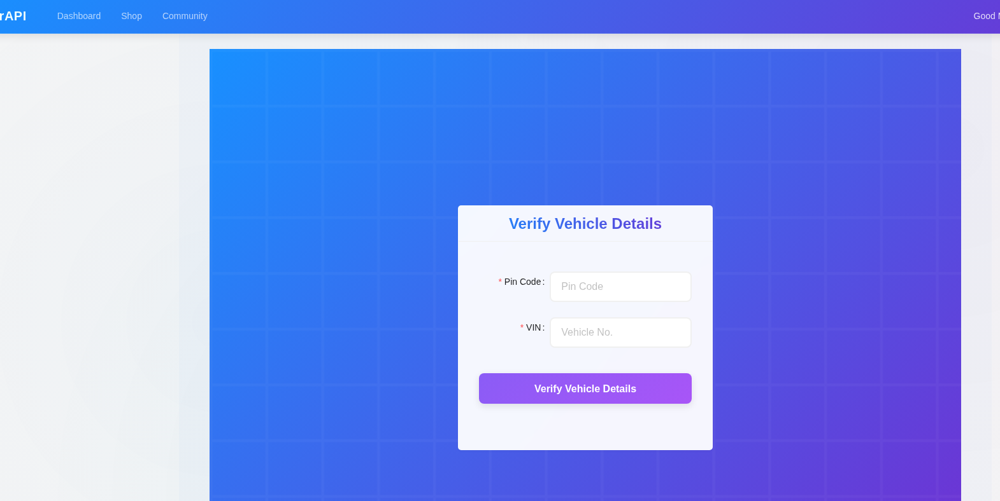

*Figure 10.0 - Add vehicle VIN and PIN form*

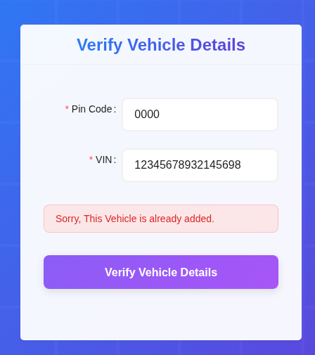

*Figure 11.0 - Vehicle already added response*

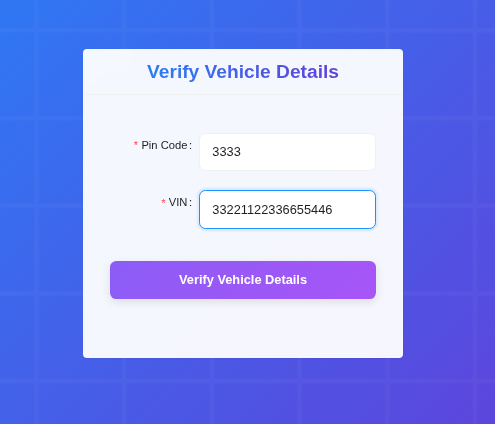

*Figure 12.0 - Vehicle details form with VIN and PIN values*

### 3.3 Shop

Observed: the shop contains two products and the user has an account balance that can be used to place an order.

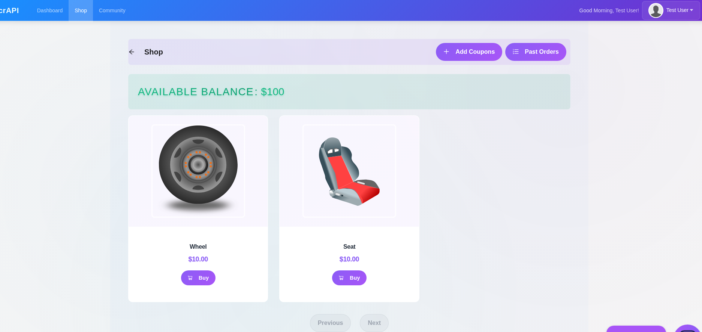

*Figure 13.0 - Shop overview showing available balance and products*

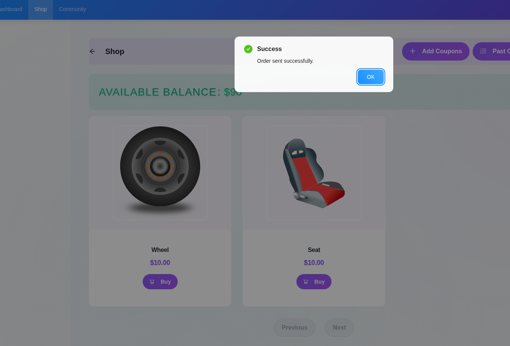

*Figure 14.0 - Successful shop order confirmation*

### 3.4 Coupon

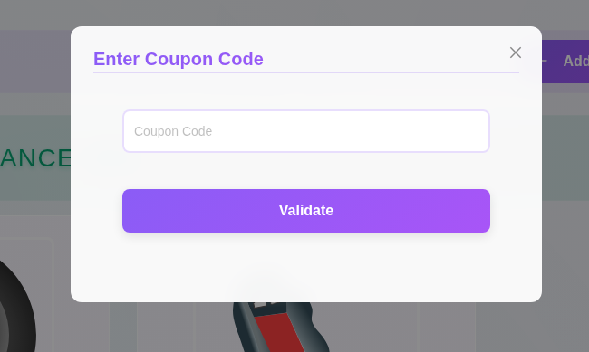

*Figure 15.0 - Add Coupon dialog*

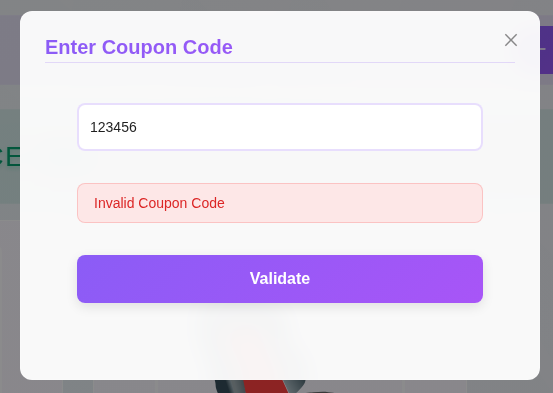

*Figure 16.0 - Invalid coupon code response*

### 3.5 Orders and Returns

Observed: users can view order history and initiate a return. The return flow displays a barcode for locating a nearby UPS service point.

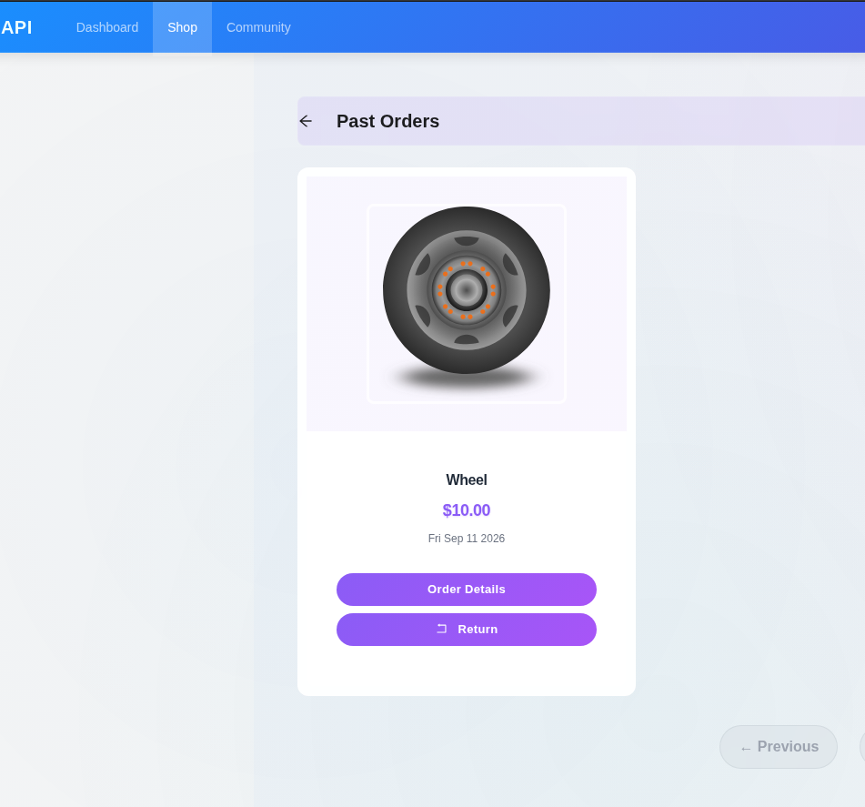

*Figure 17.0 - Past Orders page with return option*

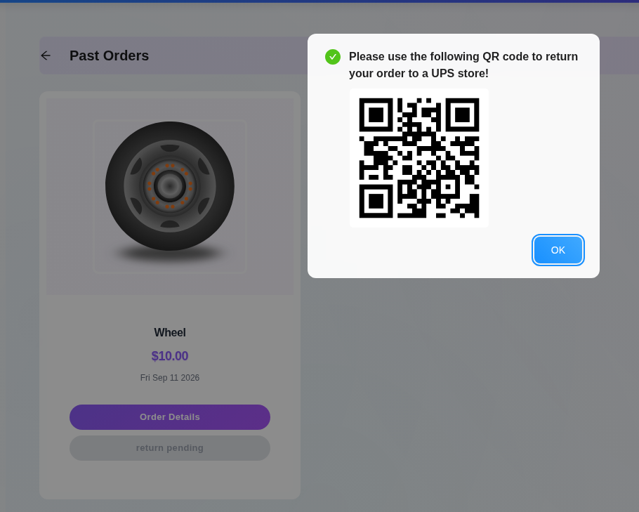

*Figure 18.0 - Return workflow QR code for UPS store*

### 3.6 Community

Observed: authenticated users can create community posts and add comments.

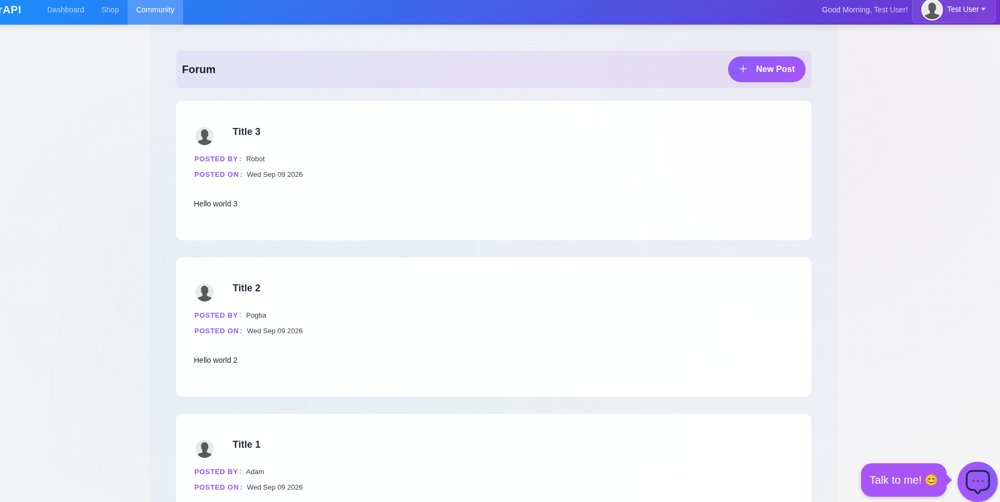

*Figure 19.0 - Community forum feed*

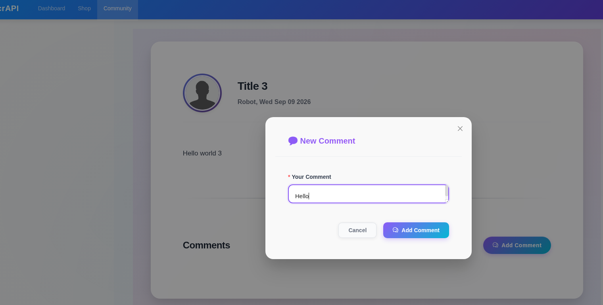

*Figure 20.0 - Add comment dialog*

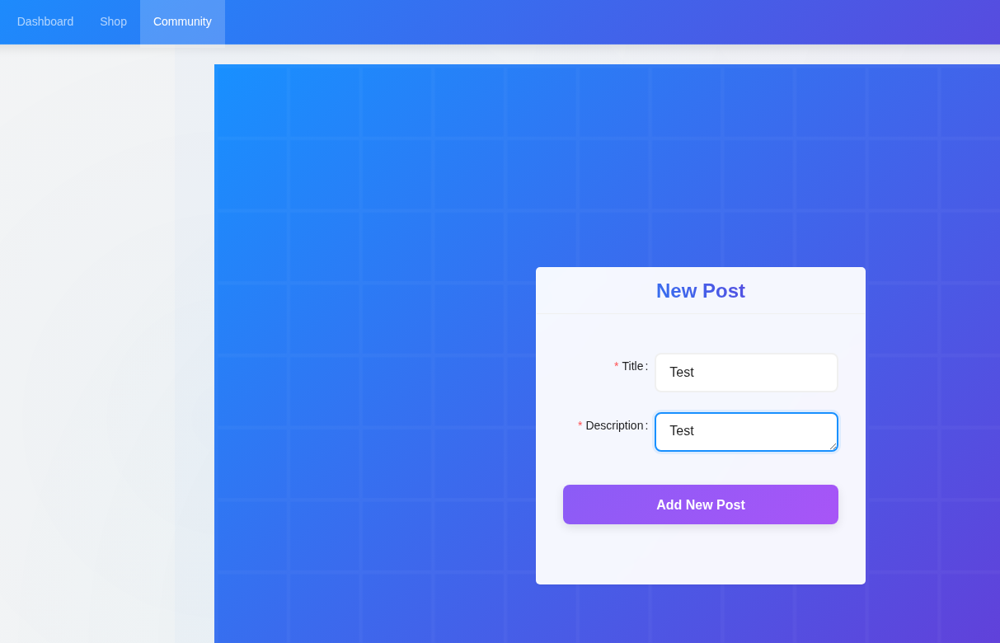

*Figure 21.0 - Create new community post form*

## 4. Supporting and Extra Features

Features that support the application but are not part of the main vehicle/shop/community business flow belong here.

### 4.1 ChatBot

Observed: the ChatBot is available before authentication and requests an OpenAI API key during initialization.

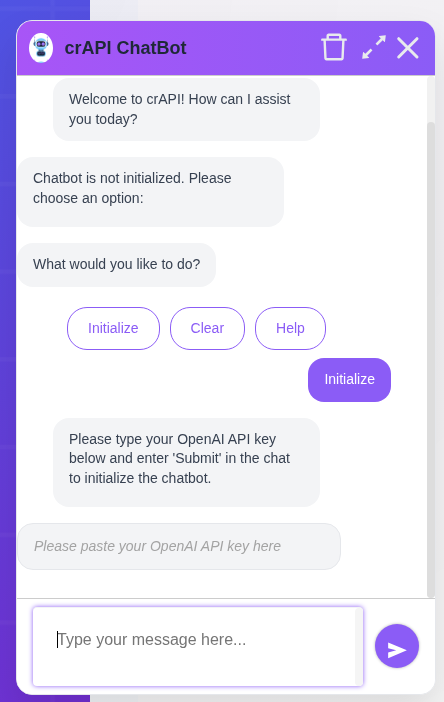

*Figure 22.0 - crAPI ChatBot initialization screen*

### 4.2 Email / MailHog

MailHog is available locally at `http://127.0.0.1:8025` for application email in the lab.

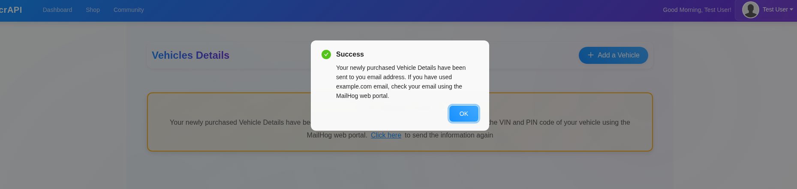

*Figure 23.0 - Vehicle details email notification referencing MailHog*

### 4.3 Other External / Supporting Interactions

Observed candidate: UPS-related return interaction.

Reference: **Figure 18.0** in Section 3.5 shows the QR-code-based UPS return interaction. The screenshot is referenced here rather than duplicated.

## 5. Normal Workflow Summary

Use one row per major user journey. This avoids repeating full workflow text throughout the document.

| ID | Workflow | Precondition | Normal Result | Screenshot Reference |
|---|---|---|---|---|
| WF-01 | Register account | Unauthenticated | Completed | 2.0 |
| WF-02 | Login | Registered account | Completed | 9.0 |
| WF-03 | Add vehicle | Authenticated | Not able to add / Error | 11.0 |
| WF-04 | Purchase item | Authenticated / balance available | Completed | 14.0 |
| WF-05 | Return order | Existing order | Need to check | 18.0 |
| WF-06 | Create community post | Authenticated | Completed | 21.0 |
| WF-07 | Comment on post | Authenticated | Completed | 20.0 |
| WF-08 | Update profile / upload media | Authenticated | Need to check | 7.0 |
| WF-09 | Recover password | Authenticated | Need to check | 4.0 |
| WF-10 | Coupon | Registered account | Not able to add / Error | 16.0 |

## 6. Application Objects Observed

| Object | Normal Purpose / Ownership Observation |
|---|---|
| User | Registered application account |
| Vehicle | Associated with a user through VIN and PIN |
| Product | Item available in the shop |
| Coupon | Adding a coupon |
| Order | Purchase created by a user |
| Return | Return request associated with an order |
| Community Post | Content created by an authenticated user |
| Comment | User interaction associated with a community post |
| Profile | User-managed account/profile information |
| Uploaded Image / Video | Media uploaded through profile functionality |

## 7. Observations and Follow-up Reconnaissance

These are observations or unknowns, not confirmed vulnerabilities.

| ID | Observation / Unknown | Follow-up |
|---|---|---|
| O-01 | Exact application roles and privilege levels are not yet confirmed. Only normal authenticated-user functionality was observed during the baseline review. | Issue #8 |
| O-02 | Authentication, session and token handling have not yet been technically mapped. | Issue #7 |
| O-03 | The ChatBot requests an OpenAI API key, but how the key is transmitted, processed, stored or used is not yet understood. | Issues #6 / #11 |
| O-04 | The return workflow generates a QR code referring the user to a UPS location. The underlying UPS-related integration and data exchange are not yet understood. | Issue #11 |
| O-05 | A complete REST API endpoint inventory has not yet been created. | Issue #6 |
| O-06 | Vehicle enrollment could not be completed. Multiple VIN/PIN combinations resulted in a message indicating that the vehicle was already added. The expected source and lifecycle of valid VIN/PIN values are not yet understood. | Issues #6 / #11 |
| O-07 | The application provides an Add Coupon function, but a valid coupon could not be obtained during the normal baseline review. The source, format and lifecycle of valid coupon codes are currently unknown. | Issue #6 |
| O-08 | Password recovery depends on an OTP sent through the application's email workflow. The complete MailHog/email delivery path has not yet been understood or documented. | Issues #7 / #11 |
| O-09 | The dashboard provides functionality to send vehicle details by email. This appears related to the vehicle-registration workflow, but the relationship between vehicle purchase, emailed VIN/PIN details and subsequent vehicle enrollment has not yet been confirmed. | Issues #6 / #11 |
| O-10 | MailHog is used by multiple application workflows, including account/OTP operations and vehicle-related email delivery. Its role within the application architecture and which services generate these emails remain to be mapped. | Issues #10 / #11 |

## 8. Functional Baseline Summary

The baseline review established the main functionality available to a standard crAPI user. An unauthenticated user can register, log in, initiate password recovery and access the ChatBot. After authentication, the user can manage profile information, access the dashboard, interact with vehicle functionality, browse and purchase products from the shop, view previous orders, initiate product returns, and participate in the community by creating posts and comments. The application also supports profile image/video uploads, coupon entry and several email-driven workflows. Important business objects observed during normal use include users, vehicles, products, coupons, orders, returns, community posts, comments, profiles and uploaded media.

Most normal application functionality was successfully exercised. However, several workflows remain only partially understood. Vehicle enrollment could not be completed because attempted VIN/PIN combinations returned a vehicle-already-added response, and no valid coupon was available to complete the coupon workflow. Password recovery and vehicle-detail delivery depend on application-generated email that appears to be accessible through MailHog, which has not yet been fully mapped. The ChatBot/OpenAI integration, UPS-related return interaction, application roles, authentication/session implementation, complete API surface and supporting service relationships also remain reconnaissance objectives. These observations are not considered vulnerabilities and will be investigated during the relevant Phase 1 activities.
