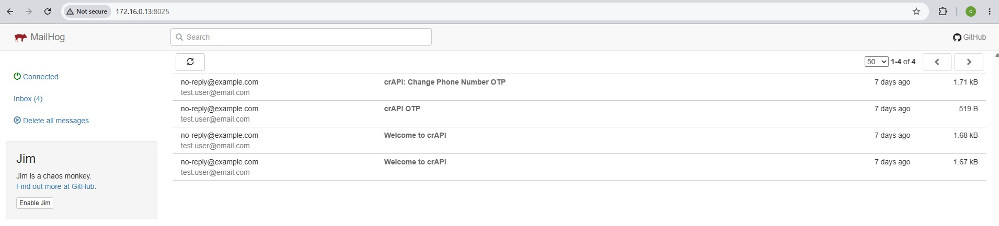

# crAPI Application Security Assessment - Service Enumeration

## Important Info 
> This document is part of a simulated white-box security assessment of OWASP crAPI for training and community reference. The client, contacts, scope details and engagement artifacts are fictitious.

## Document Control

| Field | Details |
|---|---|
| Document Title | crAPI Application Security Assessment - Service Enumeration |
| Document Type | Phase 1 Reconnaissance |
| Engagement | crAPI Application Security Assessment |
| Client Representative | Mr. Mario |
| Assessment Lead | Mr. Wario |
| Environment | UAT |
| Related GitHub Issue | Issue #4 - Enumerate exposed hosts, ports and services |
| Document Owner | Mr. Wario |
| Version | 0.9 |
| Status | Draft - Ready for Review |
| Date Created | 18 September 2026 |
| Classification | Engagement Confidential / Training Simulation |
| Repository Location | `01-recon/service-enumeration/services.md` |
| Evidence Location | `01-recon/service-enumeration/raw/` |
| Screenshot Location | `01-recon/screenshots/service-enum/` |

## Document Revision History

| Version | Date | Author | Description |
|---|---|---|---|
| 0.1 | 18 September 2026 | Mr. Wario | Initial service-enumeration structure created |
| 0.9 | 18 September 2026 | Mr. Wario | Added published services, Docker inventory, service validation, TLS observations, MailHog evidence and follow-up actions |

## Table of Contents

- [Purpose](#purpose)
- [1. Scope](#1-scope)
- [2. Enumeration Methodology](#2-enumeration-methodology)
- [3. crAPI Published Service Summary](#3-crapi-published-service-summary)
- [4. Docker Service Inventory](#4-docker-service-inventory)
- [5. Service Details](#5-service-details)
  - [5.1 crAPI Web Frontend](#51-crapi-web-frontend)
  - [5.2 MailHog Web Interface](#52-mailhog-web-interface)
- [6. Docker-Internal Supporting Services](#6-docker-internal-supporting-services)
- [7. Security-Relevant Reconnaissance Observations](#7-security-relevant-reconnaissance-observations)
- [8. Evidence Index](#8-evidence-index)
- [9. Limitations](#9-limitations)
- [10. Follow-Up Actions](#10-follow-up-actions)
- [11. Reconnaissance Summary](#11-reconnaissance-summary)

## Purpose

Identify services exposed by the approved crAPI Docker deployment, distinguish host-published services from Docker-internal supporting services, record service and version information where observable, and establish the network-service attack surface for subsequent application and API security testing.

This document is limited to services associated with the crAPI deployment. Unrelated Kali Linux host services are outside the purpose of this enumeration and are not assessed here.

## 1. Scope

| Item | Value |
|---|---|
| Application | OWASP crAPI |
| Environment | UAT / local lab |
| Deployment Platform | Docker on Kali Linux |
| Primary Application URL | `http://127.0.0.1:8888` |
| LAN Application URL Used During Recon | `http://172.16.0.13:8888` |
| Assessment Focus | crAPI Docker-published and application-supporting services |
| Excluded From This Document | Unrelated Kali host services and general host-level attack surface |

The assessment remained within the approved Rules of Engagement. No denial-of-service, stress, destructive, or high-volume testing was performed.

## 2. Enumeration Methodology

Service enumeration used multiple evidence sources so that exposure was not determined from one tool alone:

- Local TCP listener inspection using `ss`
- Docker container and published-port inspection using `docker ps`
- Targeted Nmap service/version detection against known crAPI-published ports
- Direct HTTP and HTTPS validation using `curl`
- TLS certificate inspection using OpenSSL
- Browser-based validation of application-facing services
- Content comparison across alternate HTTP and HTTPS listeners

This stage is reconnaissance only. Security-relevant items are recorded as observations until impact is validated during Phase 2.

## 3. crAPI Published Service Summary

The crAPI deployment publishes five application-related TCP ports on the Docker host.

| Host Port | Protocol | Service / Product | Docker Mapping | Exposure | Assessment Interpretation |
|---:|---|---|---|---|---|
| 8025 | HTTP | MailHog Web UI / Go HTTP service | `mailhog:8025` | Host-published | Mail capture interface used by crAPI |
| 8443 | HTTPS | OpenResty 1.27.1.2 | `crapi-web:443` | Host-published | TLS entry point for crAPI |
| 8888 | HTTP | OpenResty 1.27.1.2 | `crapi-web:80` | Host-published | Primary crAPI HTTP entry point |
| 30080 | HTTP | OpenResty 1.27.1.2 | `crapi-web:80` | Host-published | Alternate HTTP entry point for the same frontend |
| 30443 | HTTPS | nginx/OpenResty-compatible service | `crapi-web:443` | Host-published | Alternate TLS entry point for the same frontend |

Docker mappings confirm that ports `8888` and `30080` map to port `80/tcp` of `crapi-web`, while `8443` and `30443` map to port `443/tcp` of the same container.

Content captured through all four crAPI web entry points produced the same SHA-256 hash. This supports treating them as alternate exposure paths to the same logical frontend rather than separate applications.

## 4. Docker Service Inventory

| Container / Component | Image | Observed Ports | Host Published | Role / Relevance |
|---|---|---|---|---|
| `crapi-web` | `crapi/crapi-web:latest` | 80, 443 | Yes | Main web frontend / reverse proxy |
| `crapi-workshop` | `crapi/crapi-workshop:latest` | No published port observed | No | Supporting workshop component |
| `crapi-chatbot` | `crapi/crapi-chatbot:latest` | 5002, 5500 | No | Chatbot application service |
| `crapi-community` | `crapi/crapi-community:latest` | 6060 | No | Community application service |
| `crapi-identity` | `crapi/crapi-identity:latest` | 8080, 8989, 10001 | No | Identity/authentication-related service |
| `api.mypremiumdealership.com` | `crapi/gateway-service:latest` | 443 | No | Supporting API/gateway component |
| `postgresdb` | `postgres:14` | 5432 | No | PostgreSQL database |
| `mongodb` | `mongo:4.4` | 27017 | No | MongoDB database |
| `chromadb` | `chromadb/chroma:latest` | 8000 | No | ChromaDB supporting service |
| `mailhog` | `crapi/mailhog:latest` | 1025, 8025 | 8025 only | Mail capture service; SMTP remains Docker-internal |

Detailed service-to-service communication and Docker architecture are deferred to Issue #10.

## 5. Service Details

### 5.1 crAPI Web Frontend

The `crapi-web` container exposes two HTTP and two HTTPS host ports:

| Host Port | Container Port | Protocol | Nmap Identification |
|---:|---:|---|---|
| 8888 | 80 | HTTP | OpenResty 1.27.1.2 |
| 30080 | 80 | HTTP | OpenResty 1.27.1.2 |
| 8443 | 443 | HTTPS | OpenResty 1.27.1.2 |
| 30443 | 443 | HTTPS | nginx-compatible HTTPS service |

Direct content comparison showed identical captured application content across `8888`, `30080`, `8443`, and `30443`. These are therefore treated as alternate exposure paths to the same crAPI frontend.

The HTTPS listeners on `8443` and `30443` presented the same certificate identity and validity period. The certificate subject and issuer were identical and used generic placeholder values, indicating an apparently self-signed lab certificate. This is retained as reconnaissance context; formal TLS/configuration assessment is deferred to Phase 2.

### 5.2 MailHog Web Interface

MailHog was confirmed at:

`http://172.16.0.13:8025`

Returned HTML identifies the service as MailHog, and browser validation confirmed that the web interface was accessible without an authentication prompt.

The interface contained crAPI-generated email associated with application workflows.

*Figure 1.0 - MailHog web interface exposed by the crAPI deployment*

MailHog also exposes SMTP on container port `1025/tcp`; this port was not published directly to the Docker host during the observed deployment.

## 6. Docker-Internal Supporting Services

| Service | Internal Port(s) | Exposure Classification | Follow-Up |
|---|---|---|---|
| crAPI Chatbot | 5002, 5500 | Docker-internal | Correlate with application/API workflows |
| crAPI Community | 6060 | Docker-internal | Correlate with community endpoints |
| crAPI Identity | 8080, 8989, 10001 | Docker-internal | Correlate with authentication/token flows |
| Premium Dealership Gateway | 443 | Docker-internal | Review under API/integration recon |
| PostgreSQL | 5432 | Docker-internal | Architecture/configuration context |
| MongoDB | 27017 | Docker-internal | Architecture/configuration context |
| ChromaDB | 8000 | Docker-internal | Architecture/integration context |
| MailHog SMTP | 1025 | Docker-internal | Correlate with password-recovery/email workflows |

No conclusion about the security posture of these internal services is made at this stage.

## 7. Security-Relevant Reconnaissance Observations

### OBS-SVC-001 - MailHog Web Interface Accessible Without Authentication

**Observation:** MailHog is published on TCP/8025 and was accessible through the assessment network without an authentication prompt.

**Observed content:** The interface contains application-generated email and may expose security-sensitive workflow messages such as password-recovery OTP messages.

**Current classification:** Reconnaissance observation only.

**Follow-up:** Validate intended exposure, access-control expectations and security impact during Phase 2 before deciding whether this becomes a formal finding.

### OBS-SVC-002 - Multiple Published Entry Points to the Same Frontend

**Observation:** `crapi-web` publishes the same frontend through HTTP ports `8888` and `30080`, and HTTPS ports `8443` and `30443`.

**Validation:** Captured application content was identical across all four listeners.

**Current classification:** Reconnaissance observation only.

**Follow-up:** Ensure subsequent attack-surface and test-case development accounts for equivalent exposure paths where relevant.

### OBS-SVC-003 - Generic Self-Signed TLS Certificate

**Observation:** Both TLS listeners presented the same apparently self-signed certificate with generic placeholder subject information and a long validity period.

**Current classification:** Configuration observation only.

**Follow-up:** Review TLS and deployment configuration during Phase 2 security-misconfiguration testing.

## 8. Evidence Index

| Evidence ID | Description | Repository Location |
|---|---|---|
| SVC-EV-001 | Local TCP listener inventory | `01-recon/service-enumeration/raw/tcp-listeners.txt` |
| SVC-EV-002 | Docker container and published-port mapping | `01-recon/service-enumeration/raw/docker-port-mappings.txt` |
| SVC-EV-003 | Targeted Nmap scan against crAPI-published ports using LAN address | `01-recon/service-enumeration/raw/nmap-crapi-services.nmap` |
| SVC-EV-004 | Greppable Nmap output | `01-recon/service-enumeration/raw/nmap-crapi-services.gnmap` |
| SVC-EV-005 | HTTP response-header checks | `01-recon/service-enumeration/raw/http-head-checks.txt` |
| SVC-EV-006 | HTTPS response-header checks | `01-recon/service-enumeration/raw/https-head-checks.txt` |
| SVC-EV-007 | MailHog browser evidence | `01-recon/screenshots/service-enum/01-mailhog.jpg` |

Additional service-validation output can remain under `01-recon/service-enumeration/raw/` and be added to this index if retained in Git.

## 9. Limitations

- Enumeration was intentionally limited to services associated with the crAPI Docker deployment.
- Unrelated Kali Linux host services were not treated as assessment targets.
- The targeted Nmap scan against the Kali LAN address reported the known Docker-published ports as filtered, while direct browser access, Docker mappings, local listener inspection and localhost validation confirmed service availability. The LAN-address Nmap result is retained as evidence but is not used as the sole exposure determination.
- UDP enumeration was not performed because no UDP requirement was identified for this stage.
- Docker-internal services were inventoried but not actively security-tested during Issue #4.
- No denial-of-service, stress, brute-force or destructive activity was performed.
- Product/version identification is based on observable fingerprints and may require confirmation during later white-box review.

## 10. Follow-Up Actions

- **Issue #5 - Technology Fingerprinting:** Validate OpenResty/nginx and other observable technologies.
- **Issue #6 - API Inventory:** Correlate frontend listeners with REST endpoints and routing.
- **Issue #7 - Authentication Model:** Correlate identity and MailHog workflows with registration, login and password recovery.
- **Issue #9 - API Versions and Hidden Endpoints:** Check whether alternate listeners or internal components expose additional routes.
- **Issue #10 - Docker Architecture:** Build the detailed service relationship and container communication map.
- **Issue #11 - External Integrations:** Review the premium-dealership gateway and other integrations.
- **Issue #13 - Attack Surface and Test Cases:** Carry forward MailHog exposure and relevant service relationships.

## 11. Reconnaissance Summary

Issue #4 established the service-level exposure of the crAPI Docker deployment.

Five application-related ports were published:

- `8025/tcp` - MailHog web interface
- `8888/tcp` - crAPI HTTP frontend
- `30080/tcp` - alternate crAPI HTTP frontend
- `8443/tcp` - crAPI HTTPS frontend
- `30443/tcp` - alternate crAPI HTTPS frontend

The four application web ports were validated as alternate paths to the same logical crAPI frontend. MailHog was confirmed as a separately published supporting interface and was accessible without authentication during reconnaissance.

Internal application services and data stores were also identified through Docker inspection, while detailed architecture and security testing are deferred to later assessment tasks.

The collected evidence provides a sufficient service inventory to support the next Phase 1 reconnaissance activities.
